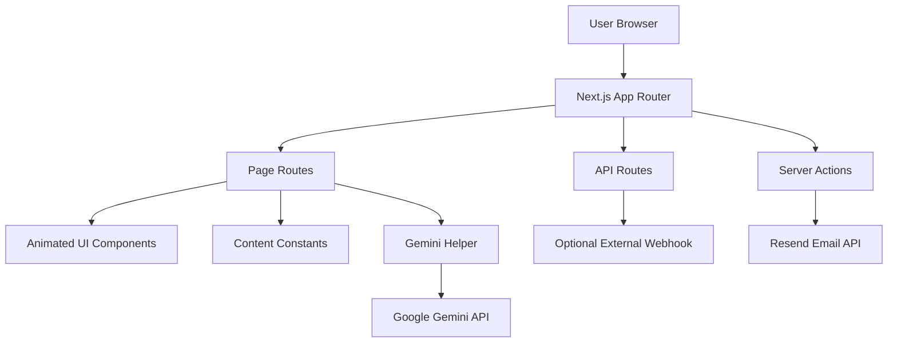
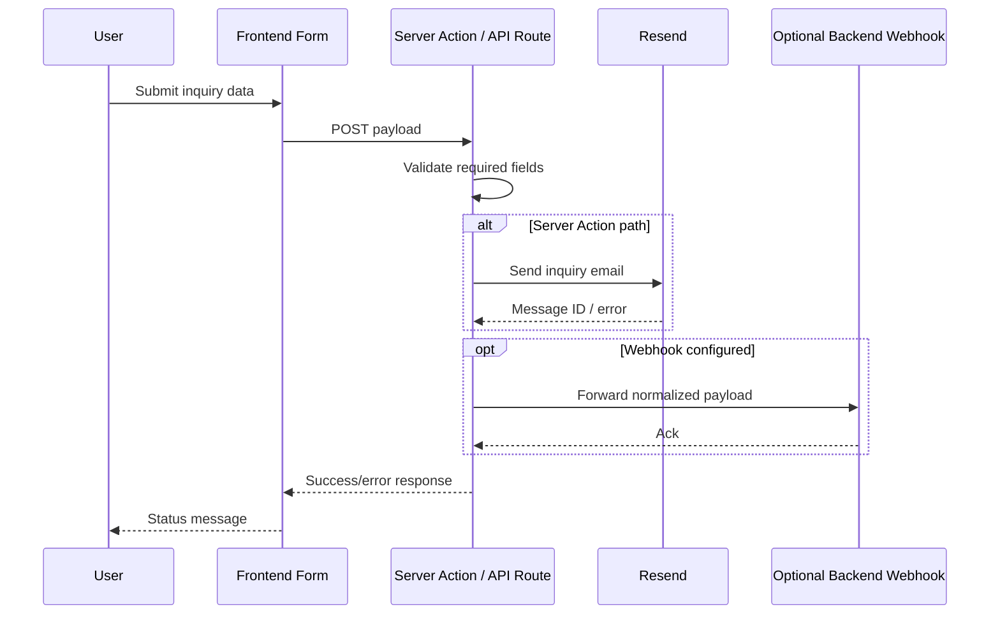

# GarudaNest Web Platform

The GarudaNest web platform is a high-impact, motion-first Next.js experience for showcasing team capability, delivery process, project proof, and inbound inquiry capture.

This README is designed as the operational source of truth for engineers, maintainers, and deployers.

## What This Project Is

GarudaNest is not a starter template. It is a production site with:

- Route-driven storytelling pages with heavy GSAP-powered animation.
- A central content layer for brand/team/project data.
- Contact and inquiry pipelines via Server Actions and API routes.
- Optional webhook forwarding for backend integration.
- AI-assisted interaction in the manifesto flow.

## Repository Model

This repo uses a root-plus-app layout:

- Root contains command proxies and hosting config.
- next-app contains the actual Next.js application.

## System Architecture



## Request Flow (Inquiry Pipeline)



## Functional Surface

### Page Routes

- / - Hero, trust, process snapshot, team, projects, testimonials.
- /about - Origin narrative, principles, team matrix.
- /process - Delivery protocol and interactive phase showcase.
- /work - Project outcomes and modal details.
- /nest - Team directory with role-based filtering.
- /nest/[slug] - Individual member profile.
- /manifesto - Philosophy + AI prompt panel + uplink form.
- /hire - Client inquiry workflow.
- /studio - Visual logs/gallery experience.

### API Routes

- POST /api/hire
	- Required: companyName, workEmail, projectScope
	- Response: ok, referenceId or validation error
- POST /api/join
	- Required: fullName, email, role
	- Optional: portfolio
	- Response: ok, referenceId or validation error
- GET /api/pulse
	- Health endpoint: timestamp + uptimeSeconds

## Technology Stack

- Framework: Next.js 16 (App Router)
- Runtime: React 19
- Styling: Tailwind CSS v4 + custom global utilities/tokens
- Motion: GSAP, @gsap/react, ScrollTrigger
- UI Icons: lucide-react
- Email transport: Resend
- AI integration: Gemini REST helper

## Code Organization

```text
.
|- package.json                 # Root proxy scripts (delegates to next-app)
|- netlify.toml                 # Netlify build + Next plugin
|- vercel.json                  # Vercel build target + rewrites
|- next-app/
|  |- package.json
|  |- next.config.ts            # Remote image host allowlist
|  |- src/
|     |- app/                   # Routes + layouts + API handlers
|     |- components/
|     |  |- layout/             # Header/Footer
|     |  |- sections/           # Route sections
|     |  |- ui/                 # Primitive/reusable visual components
|     |- lib/
|        |- constants.js        # Brand/team/project/testimonial content
|        |- actions.js          # Server action (Resend email)
|        |- gemini.js           # Gemini API helper
```

## Setup Guide

### Prerequisites

- Node.js 20+
- npm 10+

### Installation

```bash
npm install
npm install --prefix next-app
```

### Development

```bash
# From repo root
npm run dev

# Or directly
cd next-app
npm run dev
```

Local URL: http://localhost:3000

## Environment Variables

Create next-app/.env.local:

```env
RESEND_API_KEY=your_resend_key
NEXT_PUBLIC_GEMINI_API_KEY=your_gemini_key
BACKEND_WEBHOOK_URL=https://your-backend-webhook.example.com
NEXT_PUBLIC_SCHEDULER_PROVIDER=cal
NEXT_PUBLIC_SCHEDULER_URL=https://cal.com/your-team/30min
```

Behavior notes:

- RESEND_API_KEY enables server-side email dispatch.
- NEXT_PUBLIC_GEMINI_API_KEY enables client-call Gemini helper.
- BACKEND_WEBHOOK_URL is optional; if missing, forwarding is skipped.
- NEXT_PUBLIC_SCHEDULER_PROVIDER supports cal or calendly.
- NEXT_PUBLIC_SCHEDULER_URL is optional; when set, Hire success shows a one-click 30-min booking CTA with prefilled details.

## Script Reference

### Root scripts

- npm run dev -> npm run dev --prefix next-app
- npm run build -> npm run build --prefix next-app
- npm run start -> npm run start --prefix next-app
- npm run lint -> npm run lint --prefix next-app

### next-app scripts

- npm run dev - Start dev server
- npm run build - Build production bundle
- npm run start - Serve production bundle
- npm run lint - Run ESLint

## Deployment

### Netlify

Defined in netlify.toml:

- base: next-app
- command: npm run build
- publish: .next
- plugin: @netlify/plugin-nextjs

### Vercel

Defined in vercel.json:

- Uses @vercel/next build target for next-app/package.json
- Includes rewrite passthrough for app path handling

## Content Operations

Most non-code content is centralized in next-app/src/lib/constants.js.

Update this file to modify:

- Team member cards and profile details
- Project showcases and metadata
- Testimonials and services
- Budget tiers and shared brand values

## UI/UX Behavior Notes

- Hover-only effects are progressively reduced on touch devices.
- Mobile breakpoints are optimized for 320, 360, 390, and 412 widths.
- Image hosts are constrained via next.config.ts remotePatterns.
- Global overlay components are mounted in app layout (cursor/audio/ambient/preloader).

## Production Validation Checklist

Before every release:

```bash
cd next-app
npm run build
```

Then validate:

- Primary pages load and animate without overflow.
- /api/pulse responds successfully.
- Inquiry flows return expected success/error states.
- Responsive checks pass on mobile viewport presets.

## Troubleshooting

- Build succeeds but email fails:
	- Verify RESEND_API_KEY and sender domain configuration.
- Manifesto AI returns empty output:
	- Verify NEXT_PUBLIC_GEMINI_API_KEY and API quota.
- Webhook forwarding silent:
	- Confirm BACKEND_WEBHOOK_URL is reachable and accepts JSON POST.

## Security Notes

- Do not expose private server secrets in NEXT_PUBLIC_* variables.
- Keep webhook endpoint authenticated/verified server-side if used.
- Sanitize and monitor incoming user-generated form content.

## License

Private project. All rights reserved unless explicitly stated otherwise.
