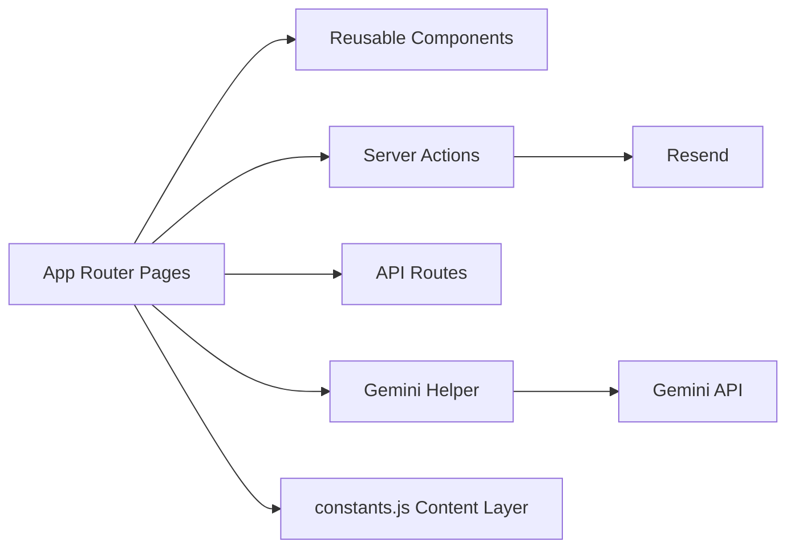

# GarudaNest Next App

Production Next.js application for the GarudaNest website.

For full repository documentation (root scripts, hosting config, route map), see ../README.md.

## Quick Start

```bash
npm install
npm run dev
```

Open http://localhost:3000.

## Scripts

- npm run dev
- npm run build
- npm run start
- npm run lint

## Environment

Create .env.local:

```env
RESEND_API_KEY=your_resend_key
RESEND_TO_EMAIL=teamgarudanest@gmail.com
RESEND_FROM_NAME=GarudaNest
RESEND_FROM_EMAIL=hello@yourdomain.com
NEXT_PUBLIC_GEMINI_API_KEY=your_gemini_key
BACKEND_WEBHOOK_URL=https://your-backend-webhook.example.com
NEXT_PUBLIC_SCHEDULER_PROVIDER=calendly
NEXT_PUBLIC_SCHEDULER_URL=https://calendly.com/your-team/discovery-call-30min
```

Deliverability note:
- For best inbox placement, use a verified sender domain in Resend for RESEND_FROM_EMAIL (avoid temporary sandbox sender addresses in production).

## Hire Discovery Workflow

1. Visitor submits the Hire brief with objective, approximate budget, timeline, meeting mode, and preferred 30-minute window.
2. Form performs front-end checks: required fields, minimum scope detail, anti-spam honeypot, and business-contact consent.
3. Server action validates payload again and sends a structured inquiry email through Resend.
4. Client gets instant Calendly booking option (prefilled) and can reserve a slot immediately.
5. Team receives inquiry details with reply-to set to lead email for quick follow-up.
6. Post-call, team sends scope summary, estimate, and next steps.

Workflow files:
- src/app/hire/page.jsx
- src/lib/actions.js

## App Diagram



## Key Directories

```text
src/
|- app/           # routes + layouts + api
|- components/    # layout, sections, ui
|- lib/           # actions, constants, gemini
```

## Production Check

```bash
npm run build
```
